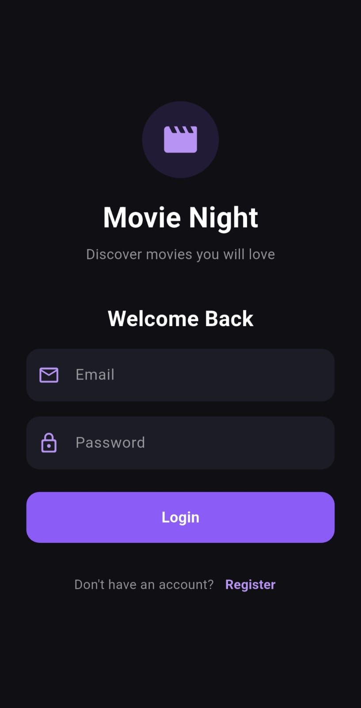
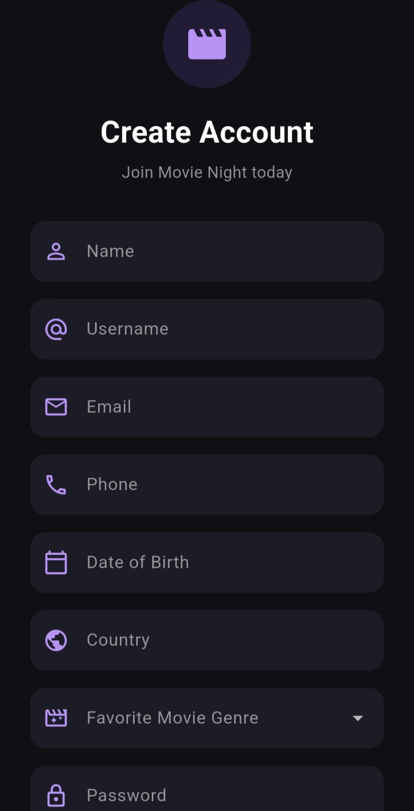
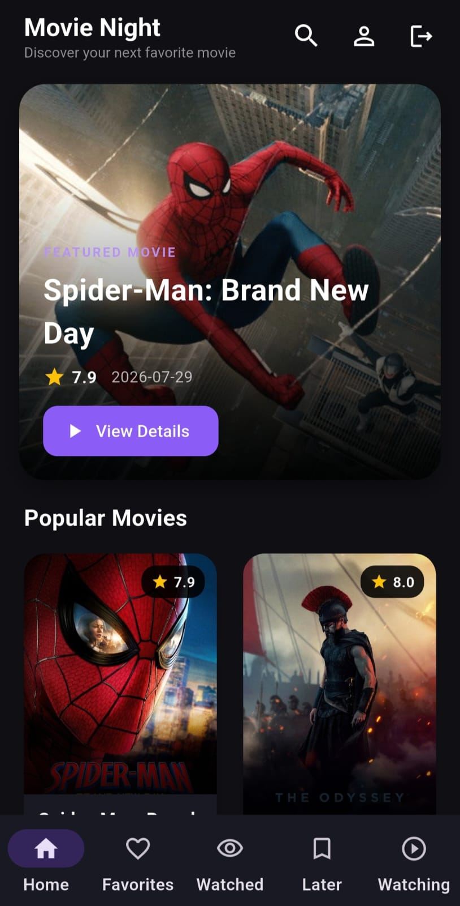
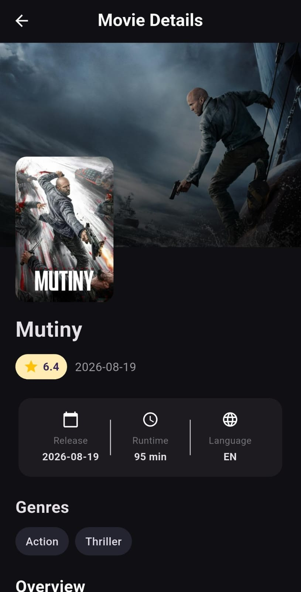
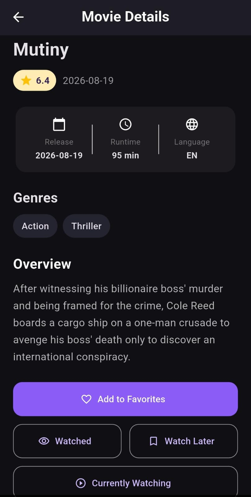
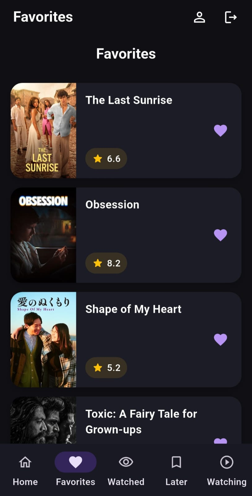
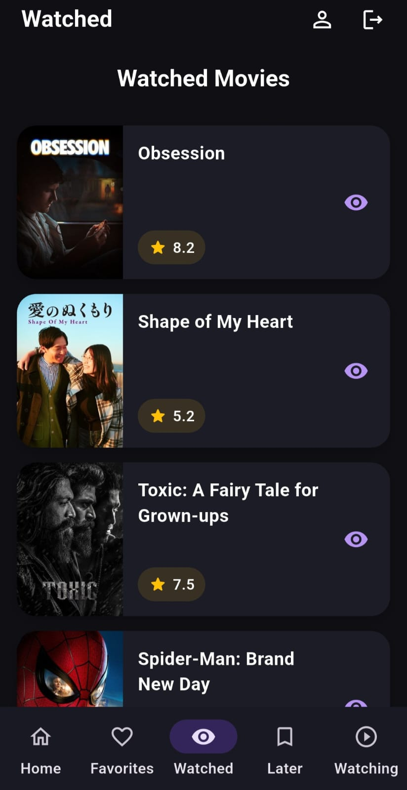
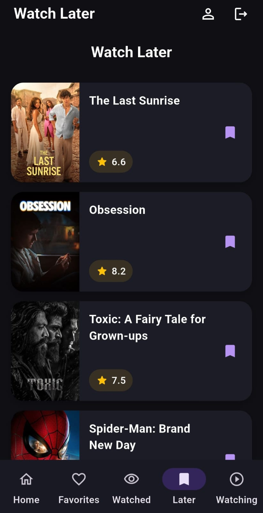
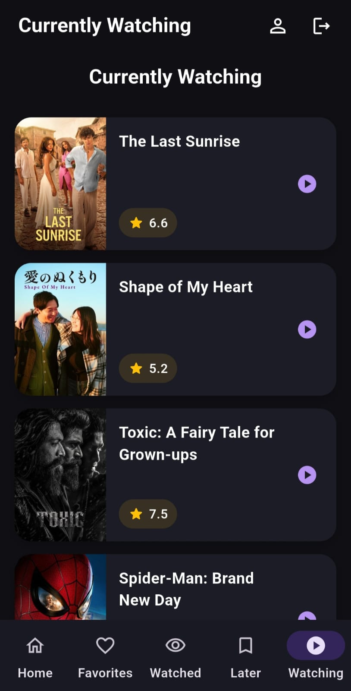
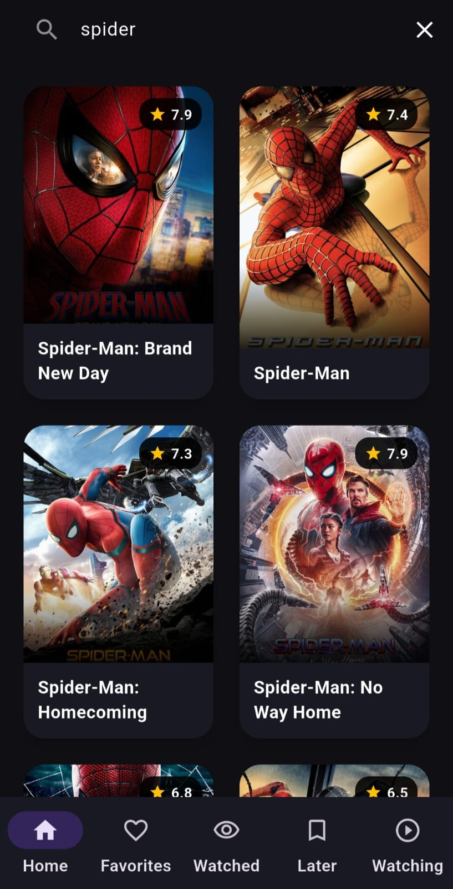

# Movie Night

A Flutter movie application that allows users to discover movies, search for movies, view movie details, and manage their personal movie lists.

## Features

- View popular movies
- Search for movies
- View movie details
- Add movies to Favorites
- Add movies to Watched
- Add movies to Watch Later
- Add movies to Currently Watching
- User Register and Login
- User Logout
- Store user profile data using Firestore
- Store saved movies using SQLite
- Pagination for movies and search results
- Loading and error handling
- Empty states for movie lists

## Technologies used

- Flutter
- Dart
- Firebase Authentication
- Cloud Firestore
- SQFLite
- Provider
- TMDB API
- MVC Architecture

## Architecture explanation

The project is divided into different parts:

- Models: Contains the movie model and represents the movie data used in the application.
- Views: Contains screens and widgets.
- Providers:Manages application state using Provider, including movies, search results, loading states, errors, saved movie list like Favorites, Watched, Watch Later, and Currently Watching
- Controllers: Connects the Provider with the services.
- Services: Handles TMDB API, SQLite, Firebase Authentication, and Firestore.

## Installation Instructions
Before running the project, make sure you have:
- Flutter installed
- Dart installed
- Android Studio or VS Code
- Internet connection

Steps to run the application:
- Clone the project.
- Open the project in Android Studio or VS Code.
- Run in Terminal:[flutter pub get]
- ((Ask the auther)) about your TMDB API token.
- Run the project:[flutter run --dart-define=TMDB_TOKEN=your_token]

## API setup instruction
The application uses the TMDB API to retrieve movie information.

TMDB API is used to get:
- Popular movies
- Search results
- Movie details
- Ratings
- Posters
- Release dates
- Genres

To use the API:
- Create a TMDB account.
- Create an API application.
- Get the API token.
- Use the token in TMDB service in the project.

## Firebase Setup instructions
Firebase is used for authentication and user profile data.
### Firebase

Firebase Authentication is used for:
- Register
- Login
- Logout
- Checking the current logged-in user

### Cloud Firestore

 Cloud Firestore is used to store user profile information, such as:
 - name 
 - username 
 - phone 
 - date of birth 
 - country
 - favorite genre
 After registration, the user's profile information is stored in Firestore.

## Database explanation 

SQFLite is used to save movies in:
- Favorites
- Watched
- Watch Later
- Currently Watching

The saved movies are connected to the logged-in user's ID.

## Application Flow
Splash Screen --> [if the user not login] Login / Register --> Home Screen --> Movie Details --> Favorites / Watched / Watch Later / Currently Watching --> Profile --> Logout

Splash Screen --> [if the user login without logout] Home Screen --> Movie Details --> Favorites / Watched / Watch Later / Currently Watching --> Profile --> Logout
 
## Screenshots
### Splash Screen
Checks whether a user is already logged in.
- If the user is logged in → Home Screen
- If the user is not logged in → Login Screen

### Login Screen
Users can login using their existing account.

### Register Screen
Users can register a new account .

### Home Screen
Displays popular movies retrieved from the TMDB API.

### Movie Details
Displays detailed information about the selected movie and allows the user to add or remove the movie from the different lists.

### Favorites

### Watched

### Watch Later

### Currently Watching

### Profile
Displays the user's profile information and provides the logout option.  

### Search Screen
The TMDB API and allows the user to search for movies.

## Known Limitations
- Movie data depends on the TMDB API and requires an internet connection.
- you should ask about [API Token] to run the application by [flutter run --dart-define=TMDB_TOKEN=your_token]

## Getting Started

This project is a starting point for a Flutter application.

A few resources to get you started if this is your first Flutter project:

- [Learn Flutter](https://docs.flutter.dev/get-started/learn-flutter)
- [Write your first Flutter app](https://docs.flutter.dev/get-started/codelab)
- [Flutter learning resources](https://docs.flutter.dev/reference/learning-resources)

For help getting started with Flutter development, view the
[online documentation](https://docs.flutter.dev/), which offers tutorials,
samples, guidance on mobile development, and a full API reference.
